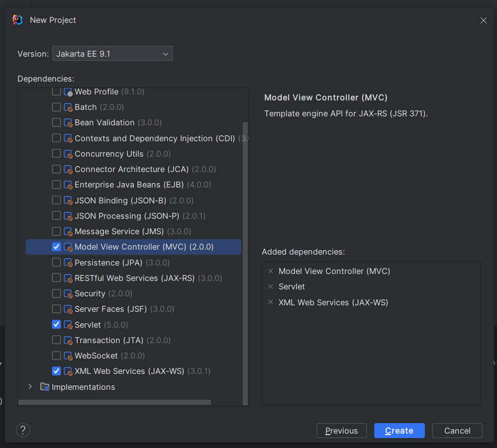
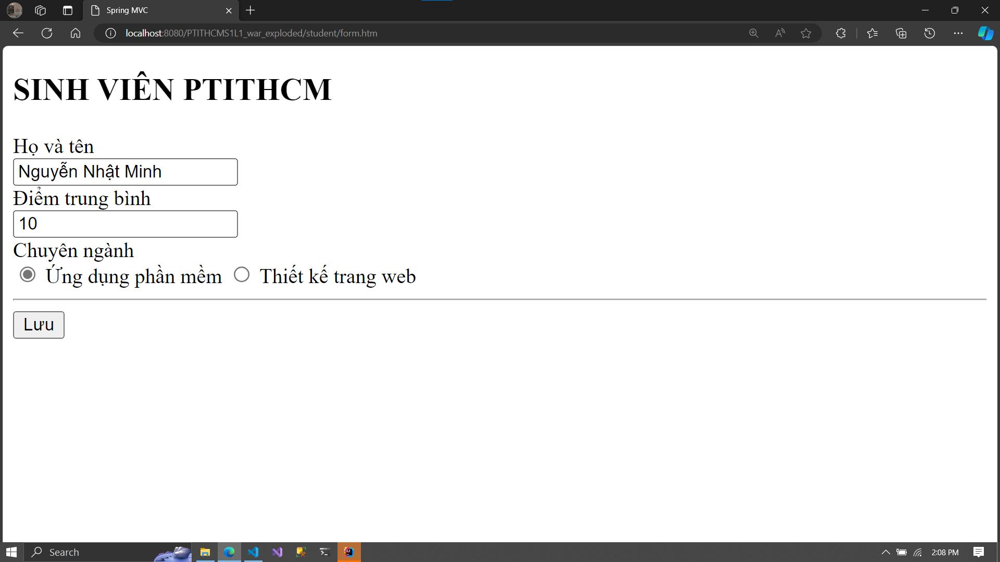

# Report lab 1 - Introduction to Spring MVC

---

## Prerequisites

- IntelliJ IDE Ultimate edition
- Tomcat server
- JDK 17+

## Setup a new project and add Tomcat server

Project informations:
- Name: PTITHCMS1L1
- Description: Lab 1 project for my web development class in PTITHCM.

Usage:
- IDE: IntelliJ IDEA Ultimate version
- Build tool: Maven

### Add Tomcat server to IntelliJ

- Go to IntelliJ settings -> Build, Executons, Deployment -> Application servers


- Add a new server by pressing the add button (the plus symbol) and choose Tomcat


- Browse for your Tomcat server location and press OK


### Chaging Tomcat server port

- Go ro Run -> Edit configurations


- Press the add config button and search for Tomcat and choose local


- System is gonna auto detect your Tomcat server settings


- From now you can change your port number

### Creating new Java EE project in IntelliJ

- Create a new project with Jakarta EE with my suggest options, then choose Next


- Inside Specifications choose: Serlet, XML web service and Spring MVC. I dont choose any implementations since I'm gonna do it manually



- Press Next to create project


- Project structure and auto generated files

Default `web.xml` file auto generated by IntelliJ:

```xml
<?xml version="1.0" encoding="UTF-8"?>
<web-app xmlns="https://jakarta.ee/xml/ns/jakartaee"
         xmlns:xsi="http://www.w3.org/2001/XMLSchema-instance"
         xsi:schemaLocation="https://jakarta.ee/xml/ns/jakartaee https://jakarta.ee/xml/ns/jakartaee/web-app_5_0.xsd"
         version="5.0">
</web-app>
```

---

## Exercise 1 - Create a Hello World webapp

### Project directory explanation

I'm using Maven as the project build system.

- `pom.xml`: This is the Maven Project Object Model file, and it is used to manage the project's build configuration, dependencies, plugins, and other settings. It can be used to specify Spring-related dependencies, plugins, and other project configurations in this file.

- `src/main/java`: This is the default source directory for my Java classes. I'll place the Spring MVC controllers, services, and other Java classes in packages under this directory.

- `src/main/resources`: This directory is used to store non-Java resources, such as configuration files, properties files, and Spring configuration files. I might place your applicationContext.xml or other Spring configuration files here.

- `src/main/webapp`: This directory contains web resources like HTML, JSP, CSS, JavaScript, and other static files.

- `webapp/WEB-INF/web.xml`: The `web.xml` file is used for configuring the Servlet container and other web-related settings. I'll configure servlets, filters, and listeners in this file.

- `src/main/resources/application.properties or application.yml`: This is where I can place my application-specific properties. I'll configure various Spring settings, database connection details, and other application-specific configurations here.

- `src/test`: This directory is for placing test classes and resources.

### Making Hello world webapp

- Inside the `webapp` directory, create a new `index.jsp` file with the below content:

```jsp
<%@ page contentType="text/html; charset=UTF-8" pageEncoding="UTF-8" %>
<!DOCTYPE html>
<html>
<head>
  <meta charset="utf-8">
  <title>Hello World</title>
</head>
<body>
  Page content
</body>
</html>
```

Note that this file might be auto generated so you can overwrite the file content.

- Run the project buy pressing the build button on the tool bar.


- IntelliJ will use your default browser to open the web


And inside the IntelliJ IDE


---

## Exercise 2 - Making Spring MVC project

### Adding Spring MVC necessary libraries to the project

I'll use these libraries:


Before adding libraries `web.xml` is looking like this:

```xml
<?xml version="1.0" encoding="UTF-8"?>
<web-app xmlns="https://jakarta.ee/xml/ns/jakartaee"
         xmlns:xsi="http://www.w3.org/2001/XMLSchema-instance"
         xsi:schemaLocation="https://jakarta.ee/xml/ns/jakartaee https://jakarta.ee/xml/ns/jakartaee/web-app_5_0.xsd"
         version="5.0">
</web-app>
```

Change the `web.xml` file to this and also add the necessary Spring dependencies to the `pom.xml` file.

`web.xml`

```xml
<?xml version="1.0" encoding="UTF-8"?>
<web-app xmlns="https://jakarta.ee/xml/ns/jakartaee"
         xmlns:xsi="http://www.w3.org/2001/XMLSchema-instance"
         xsi:schemaLocation="https://jakarta.ee/xml/ns/jakartaee https://jakarta.ee/xml/ns/jakartaee/web-app_5_0.xsd"
         version="5.0">

    <display-name>Java5</display-name>

    <!-- DispatcherServlet -->
    <servlet>
        <servlet-name>spring</servlet-name>
        <servlet-class>org.springframework.web.servlet.DispatcherServlet</servlet-class>
        <init-param>
            <param-name>contextConfigLocation</param-name>
            <param-value>/WEB-INF/configs/*.xml</param-value>
        </init-param>
        <load-on-startup>1</load-on-startup>
    </servlet>
    <servlet-mapping>
        <servlet-name>spring</servlet-name>
        <url-pattern>*.htm</url-pattern>
    </servlet-mapping>

    <!-- CharacterEncodingFilter -->
    <filter>
        <filter-name>utf8</filter-name>
        <filter-class>org.springframework.web.filter.CharacterEncodingFilter</filter-class>
        <init-param>
            <param-name>encoding</param-name>
            <param-value>UTF-8</param-value>
        </init-param>
        <init-param>
            <param-name>forceEncoding</param-name>
            <param-value>true</param-value>
        </init-param>
    </filter>
    <filter-mapping>
        <filter-name>utf8</filter-name>
        <url-pattern>/*</url-pattern>
    </filter-mapping>

    <welcome-file-list>
        <welcome-file>index.jsp</welcome-file>
    </welcome-file-list>
</web-app>
```

`pom.xml`

```xml
<?xml version="1.0" encoding="UTF-8"?>
<project xmlns="http://maven.apache.org/POM/4.0.0"
         xmlns:xsi="http://www.w3.org/2001/XMLSchema-instance"
         xsi:schemaLocation="http://maven.apache.org/POM/4.0.0 https://maven.apache.org/xsd/maven-4.0.0.xsd">
    <modelVersion>4.0.0</modelVersion>

    <groupId>com.ptithcm</groupId>
    <artifactId>PTITHCMS1L1</artifactId>
    <version>1.0-SNAPSHOT</version>
    <name>PTITHCMS1L1</name>
    <packaging>war</packaging>

    <properties>
        <project.build.sourceEncoding>UTF-8</project.build.sourceEncoding>
        <maven.compiler.target>11</maven.compiler.target>
        <maven.compiler.source>11</maven.compiler.source>
        <junit.version>5.9.2</junit.version>
    </properties>

    <dependencies>
        <dependency>
            <groupId>org.springframework</groupId>
            <artifactId>spring-context</artifactId>
            <version>4.0.1.RELEASE</version>
        </dependency>
        <dependency>
            <groupId>org.springframework</groupId>
            <artifactId>spring-tx</artifactId>
            <version>4.0.1.RELEASE</version>
        </dependency>
        <dependency>
            <groupId>org.springframework</groupId>
            <artifactId>spring-web</artifactId>
            <version>4.0.1.RELEASE</version>
        </dependency>
        <dependency>
            <groupId>org.springframework</groupId>
            <artifactId>spring-webmvc</artifactId>
            <version>4.0.1.RELEASE</version>
        </dependency>
        <dependency>
            <groupId>org.springframework</groupId>
            <artifactId>spring-beans</artifactId>
            <version>4.0.1.RELEASE</version>
        </dependency>

        <dependency>
            <groupId>jakarta.mvc</groupId>
            <artifactId>jakarta.mvc-api</artifactId>
            <version>2.0.0</version>
        </dependency>
        <dependency>
            <groupId>javax.servlet</groupId>
            <artifactId>javax.servlet-api</artifactId>
            <version>4.0.1</version>
        </dependency>
        <dependency>
            <groupId>jakarta.xml.ws</groupId>
            <artifactId>jakarta.xml.ws-api</artifactId>
            <version>3.0.1</version>
            <scope>provided</scope>
        </dependency>
        <dependency>
            <groupId>org.junit.jupiter</groupId>
            <artifactId>junit-jupiter-api</artifactId>
            <version>${junit.version}</version>
            <scope>test</scope>
        </dependency>
        <dependency>
            <groupId>org.junit.jupiter</groupId>
            <artifactId>junit-jupiter-engine</artifactId>
            <version>${junit.version}</version>
            <scope>test</scope>
        </dependency>
    </dependencies>

    <build>
        <plugins>
            <plugin>
                <groupId>org.apache.maven.plugins</groupId>
                <artifactId>maven-war-plugin</artifactId>
                <version>3.3.2</version>
            </plugin>
        </plugins>
    </build>
</project>
```

Add a new `spring-config-mvc.xml` file at `src/main/webapp/WEB-INF/configs` with the below content:

```xml
<?xml version="1.0" encoding="UTF-8"?>
<beans xmlns="http://www.springframework.org/schema/beans"
       xmlns:xsi="http://www.w3.org/2001/XMLSchema-instance"
       xmlns:context="http://www.springframework.org/schema/context"
       xmlns:p="http://www.springframework.org/schema/p"
       xmlns:tx="http://www.springframework.org/schema/tx"
       xmlns:mvc="http://www.springframework.org/schema/mvc"
       xsi:schemaLocation="http://www.springframework.org/schema/beans
	   		http://www.springframework.org/schema/beans/spring-beans.xsd
	   		http://www.springframework.org/schema/context
	   		http://www.springframework.org/schema/context/spring-context.xsd
	   		http://www.springframework.org/schema/tx
			http://www.springframework.org/schema/tx/spring-tx.xsd
			http://www.springframework.org/schema/mvc
			http://www.springframework.org/schema/mvc/spring-mvc.xsd">

    <!-- Spring MVC Annotation -->
    <context:annotation-config />
    <mvc:annotation-driven/>

    <!-- Cấu hình view -->
    <bean id="viewResolver"
          p:prefix="/WEB-INF/views/" p:suffix=".jsp"
          class="org.springframework.web.servlet.view.InternalResourceViewResolver"/>

    <!-- Cấu hình package chứa các controller -->
    <context:component-scan base-package="com.ptithcm.ptithcms1l1.controller"/>

</beans>
```

Remember to reload project after adding dependencies to the `pom.xml` file.

After successfully added the dependencies, create a new `controller` packed and a new `WelcomeController.java` file inside it.

`WelcomeController.java`

```java
package com.example.ptithcms1l1.controller;

import org.springframework.stereotype.Controller;
import org.springframework.web.bind.annotation.RequestMapping;

@Controller
public class WellcomeController {
    @RequestMapping("/welcome")
    public String wellcome() {
        return "welcome";
    }
}
```

Inside the `WEB-INF/views` create a new `welcome.jsp` view with this content:

`welcome.jsp`

```jsp
<%@ page contentType="text/html; charset=UTF-8" pageEncoding="UTF-8" %>
<!DOCTYPE html>
<html>
<head>
    <meta charset="utf-8">
    <title>Spring MVC</title>
</head>
<body>
    <h1>Welcome to Spring MVC</h1>
</body>
</html>
```

The project should look like this:


Then run the project at `/welcome.htm`:


---

## Exercise 3 - Making student controller with a form view

Create a `StudentController.java` class inside the `controller` package with this content:

`StudentController.java`

```java
ppackage com.example.ptithcms1l1.controller;

import org.springframework.stereotype.Controller;
import org.springframework.web.bind.annotation.RequestMapping;

@Controller
public class StudentController {
    @RequestMapping("/student/form")
    public String showForm() {
        return "student/form";
    }
}

```

Create a new `form.jsp` view inside the `WEB-INF/views/student` directory with this content:

```jsp
<%@ page pageEncoding="utf-8" %>
<!DOCTYPE html>
<html>
<head>
    <meta charset="utf-8"/>
    <title>Spring MVC</title>
    <base href="${pageContext.servletContext.contextPath}/">
</head>
<body>
<h2>SINH VIÊN PTITHCM</h2>

<form action="student/save-data.htm" method="post">
    <div>Họ và tên</div>
    <input name = "name"/>
    <div>Điểm trung bình</div>
    <input name = "mark"/>
    <div>Chuyên ngành</div>
    <label>
        <input name="major" type="radio" value="APP"/>
        Ứng dụng phần mềm
    </label>
    <label>
        <input name="major" type="radio" value="WEB"/>
        Thiết kế trang web
    </label>
    <hr>
    <button>Lưu</button>
</form>
</body>
</html>
```

The project structure should looks like this:


And the result when you run the server at `/student/form.htm`:


---

## Exercise 4 - Receiving data from the student form

Inside the `StudentController.java` class, add another method with the below content:

```java
ackage com.ptithcm.ptithcms1l1.controller;

import org.springframework.stereotype.Controller;
import org.springframework.web.bind.annotation.RequestMapping;

import javax.servlet.http.HttpServletRequest;

@Controller
public class StudentController {
    @RequestMapping("/student/form")
    public String showForm() {
        return "student/form";
    }

    @RequestMapping("student/save-data")
    public String saveData(HttpServletRequest request) {
        String name = request.getParameter("name");
        String mark = request.getParameter("mark");
        String major = request.getParameter("major");

        request.setAttribute("name", name);
        request.setAttribute("mark", mark);
        request.setAttribute("major", major);
        return "student/success";
    }
}
```

Create a new `success.jsp` view inside the `WEB-INF/views/student` directory with the below content:

`success.jsp`

```jsp
<%@ page contentType="text/html;charset=UTF-8" language="java" %>
<html>
<head>
    <meta charset="utf-8">
    <title>Spring MVC</title>
</head>
<body>
    <h1>THÔNG TIN SINH VIÊN PTITHCM</h1>
    <ul>
        <li>HỌ VÀ TÊN: ${name}</li>
        <li>ĐIỂM TB: ${mark}</li>
        <li>CHUYÊN NGÀNH: ${major}</li>
    </ul>
</body>
</html>
```

Return the project and go to `/student/form.htm` to fill in the form then submit the form. You should be routed to `/student/save-data.htm`




