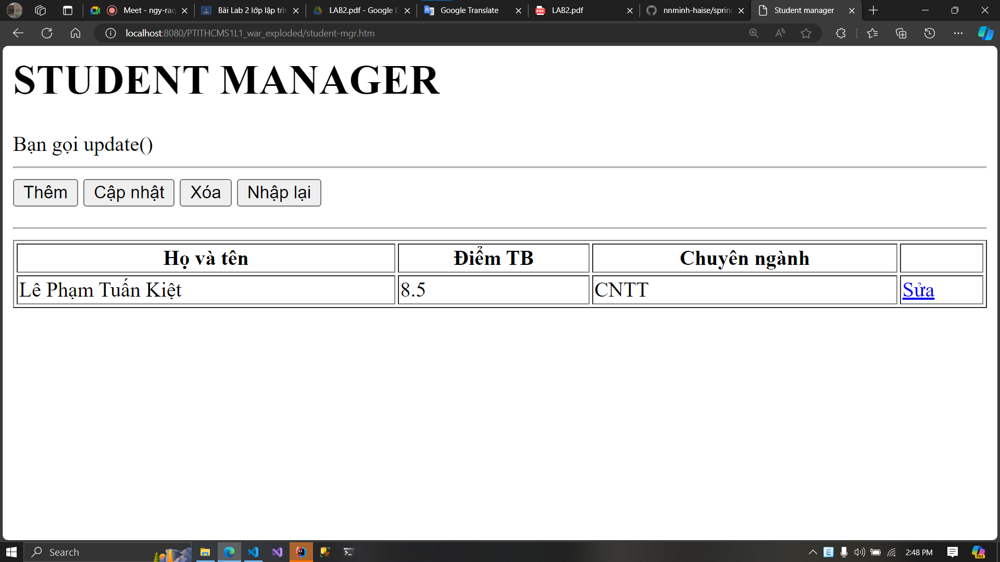
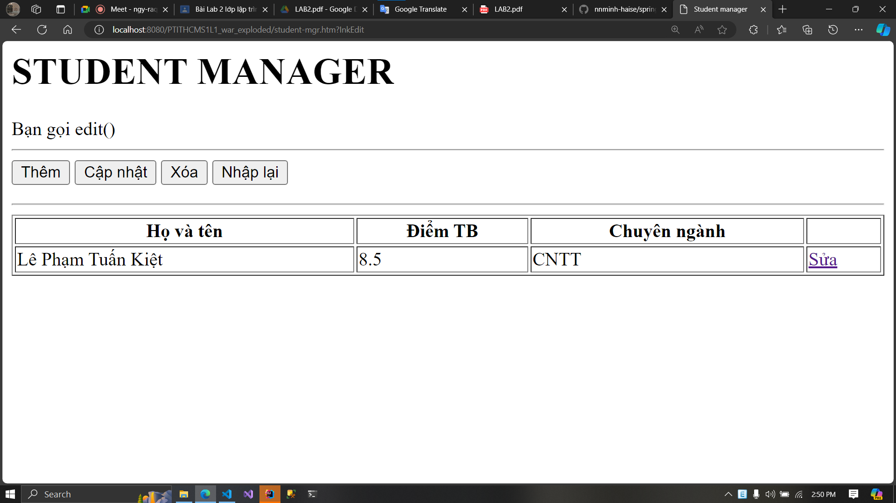
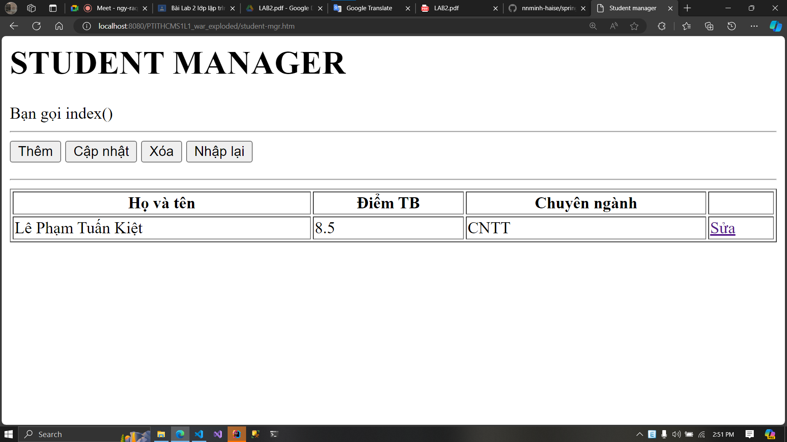
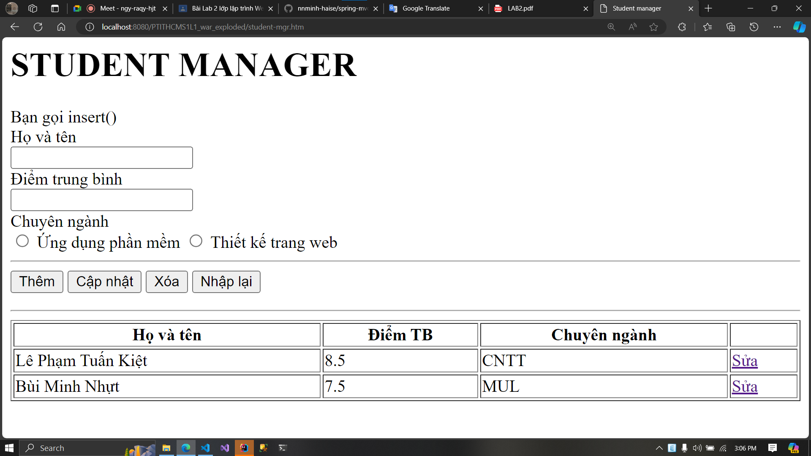
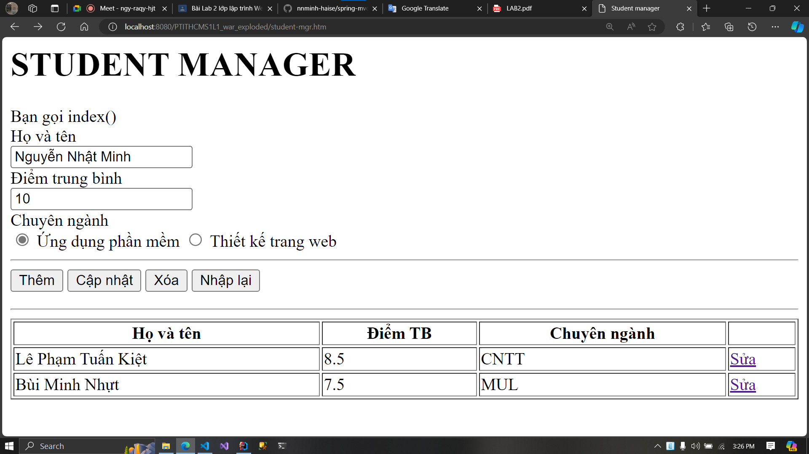
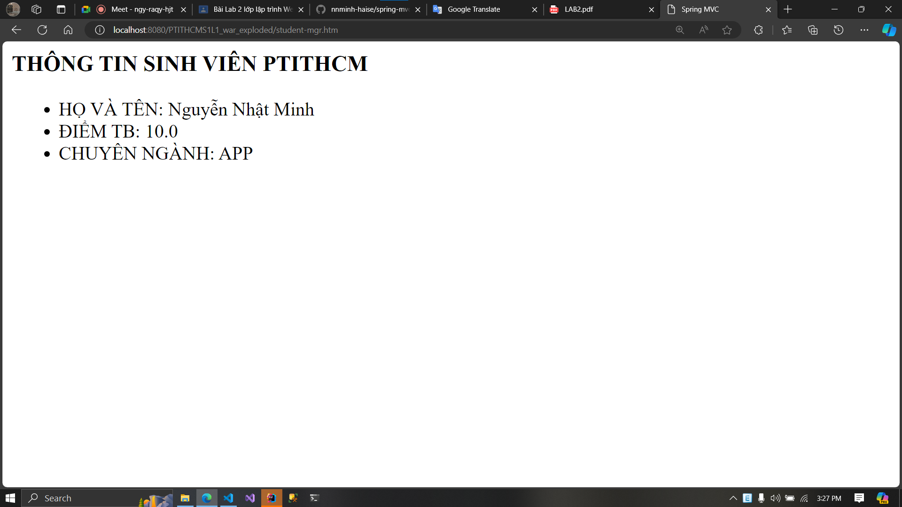
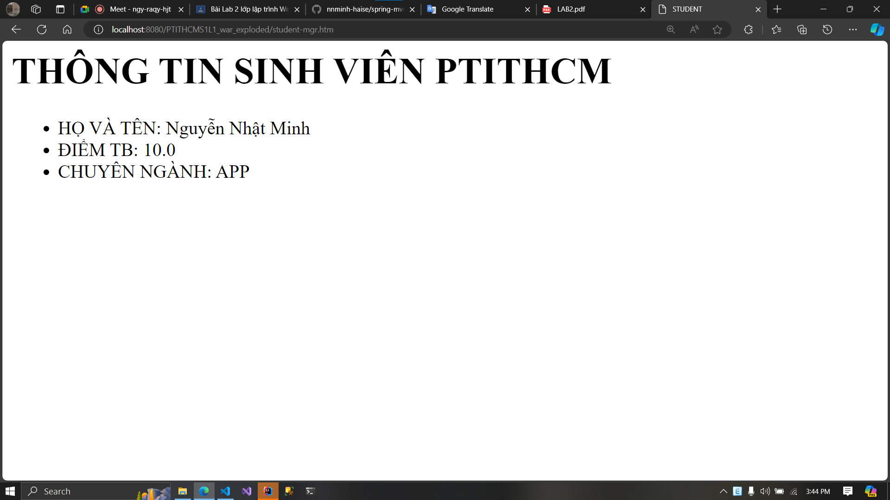

# Lab 2: Working with Controllers

---

This lab will use the previous code of the Lab 1.

## Exercise 1

We will modify the previous two controllers inside the `StudentController`.

*Previous code:*

```java
import org.springframework.stereotype.Controller;
import org.springframework.web.bind.annotation.RequestMapping;

import javax.servlet.http.HttpServletRequest;

@Controller
public class StudentController {
    @RequestMapping("/student/form")
    public String showForm() {
        return "student/form";
    }

    @RequestMapping("student/save-data")
    public String saveData(HttpServletRequest request) {
        String name = request.getParameter("name");
        String mark = request.getParameter("mark");
        String major = request.getParameter("major");

        request.setAttribute("name", name);
        request.setAttribute("mark", mark);
        request.setAttribute("major", major);
        return "student/success";
    }
}
```

*Modified code:*

```java
import org.springframework.stereotype.Controller;
import org.springframework.web.bind.annotation.RequestMapping;
import org.springframework.web.bind.annotation.RequestMethod;

import javax.servlet.http.HttpServletRequest;

@Controller
public class StudentController {
    @RequestMapping(value = "/student", method = RequestMethod.GET)
    public String showForm() {
        return "student/form";
    }

    @RequestMapping(value = "/student", method = RequestMethod.POST)
    public String saveData(HttpServletRequest request) {
        String name = request.getParameter("name");
        String mark = request.getParameter("mark");
        String major = request.getParameter("major");

        request.setAttribute("name", name);
        request.setAttribute("mark", mark);
        request.setAttribute("major", major);
        
        return "student/success";
    }
}
```

Inside the lab 1 exercise 4, we've created the two views: `form.jsp` and `success.jsp`:

`form.jsp`

```jsp
<%@ page pageEncoding="utf-8" %>
<!DOCTYPE html>
<html>
<head>
    <meta charset="utf-8"/>
    <title>Spring MVC</title>
    <base href="${pageContext.servletContext.contextPath}/">
</head>
<body>
    <h2>SINH VIÊN PTITHCM</h2>
    <form action="student/save-data.htm" method="post">
        <div>Họ và tên</div>
        <input name = "name"/>
        <div>Điểm trung bình</div>
        <input name = "mark"/>
        <div>Chuyên ngành</div>
        <label>
            <input name="major" type="radio" value="APP"/>
            Ứng dụng phần mềm
        </label>
        <label>
            <input name="major" type="radio" value="WEB"/>
            Thiết kế trang web
        </label>
        <hr>
        <button>Lưu</button>
    </form>
</body>
</html>
```

`success.jsp`

```jsp
<%@ page contentType="text/html;charset=UTF-8" %>
<html>
<head>
    <meta charset="utf-8">
    <title>Spring MVC</title>
</head>
<body>
    <h1>THÔNG TIN SINH VIÊN PTITHCM</h1>
    <ul>
        <li>HỌ VÀ TÊN: ${name}</li>
        <li>ĐIỂM TB: ${mark}</li>
        <li>CHUYÊN NGÀNH: ${major}</li>
    </ul>
</body>
</html>
```

We will modified the two like below:

`login.jsp`

```jsp
<%@ page pageEncoding="utf-8" %>
<!DOCTYPE html>
<html>
<head>
    <meta charset="utf-8"/>
    <title>Spring MVC</title>
    <base href="${pageContext.servletContext.contextPath}/">
</head>
<body>
    <h2>SINH VIÊN PTITHCM</h2>
    <form action="student.htm" method="post">
        <div>Họ và tên</div>
        <input name = "name"/>
        <div>Điểm trung bình</div>
        <input name = "mark"/>
        <div>Chuyên ngành</div>
        <label>
            <input name="major" type="radio" value="APP"/>
            Ứng dụng phần mềm
        </label>
        <label>
            <input name="major" type="radio" value="WEB"/>
            Thiết kế trang web
        </label>
        <hr>
        <button>Lưu</button>
    </form>
</body>
</html>
```

`success.jsp`

```jsp
<%@ page contentType="text/html;charset=UTF-8" %>
<html>
<head>
    <meta charset="utf-8">
    <title>Spring MVC</title>
</head>
<body>
    <h3>THÔNG TIN SINH VIÊN PTITHCM</h3>
    <ul>
        <li>HỌ VÀ TÊN: ${name}</li>
        <li>ĐIỂM TB: ${mark}</li>
        <li>CHUYÊN NGÀNH: ${major}</li>
    </ul>
</body>
</html>
```

Rerun the application at: `http://localhost:8080/PTITHCMS1L1_war_exploded/student.htm`


After filling the form, press "Submit" then the result will be at: `http://localhost:8080/PTITHCMS1L1_war_exploded/student.htm`


---

## Exercise 2

We will modify the `StudentController` controller:

```java
package com.ptithcm.ptithcms1l1.controller;

import org.springframework.stereotype.Controller;
import org.springframework.web.bind.annotation.RequestMapping;
import org.springframework.web.bind.annotation.RequestMethod;
import org.springframework.ui.ModelMap;

import javax.servlet.http.HttpServletRequest;

@Controller
@RequestMapping("/student-mgr")
public class StudentController {
    @RequestMapping(value = "/student", method = RequestMethod.GET)
    public String showForm() {
        return "student/form";
    }

    @RequestMapping(value = "/student", method = RequestMethod.POST)
    public String saveData(HttpServletRequest request) {
        String name = request.getParameter("name");
        String mark = request.getParameter("mark");
        String major = request.getParameter("major");

        request.setAttribute("name", name);
        request.setAttribute("mark", mark);
        request.setAttribute("major", major);

        return "student/success";
    }

    @RequestMapping()
    public String index(ModelMap model) {
        model.addAttribute("message", "Bạn gọi index()");
        return "student/student-mgr";
    }

    @RequestMapping(params = "btnInsert")
    public String insert(ModelMap model) {
        model.addAttribute("message", "Bạn gọi insert()");
        return "student/student-mgr";
    }

    @RequestMapping(params = "btnUpdate")
    public String update(ModelMap model) {
        model.addAttribute("message", "Bạn gọi update()");
        return "student/student-mgr";
    }

    @RequestMapping(params = "btnDelete")
    public String delete(ModelMap model) {
        model.addAttribute("message", "Bạn gọi delete()");
        return "student/student-mgr";
    }

    @RequestMapping(params = "InkEdit")
    public String edit(ModelMap model) {
        model.addAttribute("message", "Bạn gọi edit()");
        return "student/student-mgr";
    }
}
```

We will add a new `student-mgr.jsp` view:

```jsp
<%@ page contentType="text/html;charset=UTF-8" language="java" %>
<html>
<head>
    <title>Student manager</title>
</head>
<body>
    <h1>STUDENT MANAGER</h1>
    <form action="student-mgr.htm" method="post">
        ${message}
        <hr>
        <button name="btnInsert">Thêm</button>
        <button name="btnUpdate">Cập nhật</button>
        <button name="btnDelete">Xóa</button>
        <button name="btnReset">Nhập lại</button>
    </form>
    <hr>
    <table border="1" style="width: 100%">
        <tr>
            <th>Họ và tên</th>
            <th>Điểm TB</th>
            <th>Chuyên ngành</th>
            <th></th>
        </tr>
        <tr>
            <td>Lê Phạm Tuấn Kiệt</td>
            <td>8.5</td>
            <td>CNTT</td>
            <td><a href="student-mgr.htm?InkEdit">Sửa</a></td>
        </tr>
    </table>
</body>
</html>
```

We will go to: `http://localhost:8080/PTITHCMS1L1_war_exploded/student-mgr.htm` to see the results:









## Exercise 3

We will add more controller into the `student-mgr.jsp` view:

```jsp
<%@ page contentType="text/html;charset=UTF-8" language="java" %>
<html>
<head>
    <title>Student manager</title>
</head>
<body>
    <h1>STUDENT MANAGER</h1>
    <form action="student-mgr.htm" method="post">
        ${message}
        <div>Họ và tên</div>
        <input name="name">

        <div>Điểm trung bình</div>
        <input name="mark">

        <div>Chuyên ngành</div>
        <label>
            <input name="major" type="radio" value="APP">
            Ứng dụng phần mềm
        </label>
        <label>
            <input name="major" type="radio" value="WEB">
            Thiết kế trang web
        </label>

        <hr>
        <button name="btnInsert">Thêm</button>
        <button name="btnUpdate">Cập nhật</button>
        <button name="btnDelete">Xóa</button>
        <button name="btnReset">Nhập lại</button>
    </form>
    <hr>
    <table border="1" style="width: 100%">
        <tr>
            <th>Họ và tên</th>
            <th>Điểm TB</th>
            <th>Chuyên ngành</th>
            <th></th>
        </tr>
        <tr>
            <td>Lê Phạm Tuấn Kiệt</td>
            <td>8.5</td>
            <td>CNTT</td>
            <td><a href="student-mgr.htm?InkEdit">Sửa</a></td>
        </tr>
        <tr>
            <td>Bùi Minh Nhựt</td>
            <td>7.5</td>
            <td>MUL</td>
            <td><a href="student-mgr.htm?InkEdit">Sửa</a></td>
        </tr>
    </table>
</body>
</html>
```

We will go to `http://localhost:8080/PTITHCMS1L1_war_exploded/student-mgr.htm` to see the result:



## Exercise 4

Modify the `StudentController` controller to add the functionality into the controller:

```java
package com.ptithcm.ptithcms1l1.controller;

import org.springframework.stereotype.Controller;
import org.springframework.web.bind.annotation.RequestMapping;
import org.springframework.web.bind.annotation.RequestMethod;
import org.springframework.ui.ModelMap;
import org.springframework.web.bind.annotation.RequestParam;

import javax.servlet.http.HttpServletRequest;

@Controller
@RequestMapping("/student-mgr")
public class StudentController {
    @RequestMapping(value = "/student", method = RequestMethod.GET)
    public String showForm() {
        return "student/form";
    }

    @RequestMapping(value = "/student", method = RequestMethod.POST)
    public String saveData(HttpServletRequest request) {
        String name = request.getParameter("name");
        String mark = request.getParameter("mark");
        String major = request.getParameter("major");

        request.setAttribute("name", name);
        request.setAttribute("mark", mark);
        request.setAttribute("major", major);

        return "student/success";
    }

    @RequestMapping()
    public String index(ModelMap model) {
        model.addAttribute("message", "Bạn gọi index()");
        return "student/student-mgr";
    }

    @RequestMapping(params = "btnInsert")
    public String insert(
            ModelMap model,
            @RequestParam("name") String name,
            @RequestParam("mark") Double mark,
            @RequestParam("major") String major
    ) {
        model.addAttribute("name", name);
        model.addAttribute("mark", mark);
        model.addAttribute("major", major);
        return "student/success";
    }

    @RequestMapping(params = "btnUpdate")
    public String update(ModelMap model) {
        model.addAttribute("message", "Bạn gọi update()");
        return "student/student-mgr";
    }

    @RequestMapping(params = "btnDelete")
    public String delete(ModelMap model) {
        model.addAttribute("message", "Bạn gọi delete()");
        return "student/student-mgr";
    }

    @RequestMapping(params = "InkEdit")
    public String edit(ModelMap model) {
        model.addAttribute("message", "Bạn gọi edit()");
        return "student/student-mgr";
    }
}
```

Rerun the server and go to `http://localhost:8080/PTITHCMS1L1_war_exploded/student-mgr.htm` to see the result:



And the result:



## Exercise 5

Create new package `bean` and new `Student.java` class inside the `bean` package:

`Student.java`

```java
package com.ptithcm.ptithcms1l1.bean;

public class Student {
    private String name;
    private Double mark;
    private String major;

    public Student() {

    }

    public Student(String name, Double mark, String major) {
        this.name = name;
        this.mark = mark;
        this.major = major;
    }

    public String getName() {
        return name;
    }

    public void setName(String name) {
        this.name = name;
    }

    public Double getMark() {
        return mark;
    }

    public void setMark(Double mark) {
        this.mark = mark;
    }

    public String getMajor() {
        return major;
    }

    public void setMajor(String major) {
        this.major = major;
    }
}
```

Update the `update` method inside the `StudentController` controller:

`StudentController.java`

```java
package com.ptithcm.ptithcms1l1.controller;

import com.ptithcm.ptithcms1l1.bean.Student;
import org.springframework.stereotype.Controller;
import org.springframework.web.bind.annotation.RequestMapping;
import org.springframework.web.bind.annotation.RequestMethod;
import org.springframework.ui.ModelMap;
import org.springframework.web.bind.annotation.RequestParam;

import javax.servlet.http.HttpServletRequest;

@Controller
@RequestMapping("/student-mgr")
public class StudentController {
    @RequestMapping(value = "/student", method = RequestMethod.GET)
    public String showForm() {
        return "student/form";
    }

    @RequestMapping(value = "/student", method = RequestMethod.POST)
    public String saveData(HttpServletRequest request) {
        String name = request.getParameter("name");
        String mark = request.getParameter("mark");
        String major = request.getParameter("major");

        request.setAttribute("name", name);
        request.setAttribute("mark", mark);
        request.setAttribute("major", major);

        return "student/success";
    }

    @RequestMapping()
    public String index(ModelMap model) {
        model.addAttribute("message", "Bạn gọi index()");
        return "student/student-mgr";
    }

    @RequestMapping(params = "btnInsert")
    public String insert(
            ModelMap model,
            @RequestParam("name") String name,
            @RequestParam("mark") Double mark,
            @RequestParam("major") String major
    ) {
        model.addAttribute("name", name);
        model.addAttribute("mark", mark);
        model.addAttribute("major", major);
        return "student/success";
    }

    @RequestMapping(params = "btnUpdate")
    public String update(ModelMap model, Student student) {
        model.addAttribute("student", student);
        return "student/success2";
    }

    @RequestMapping(params = "btnDelete")
    public String delete(ModelMap model) {
        model.addAttribute("message", "Bạn gọi delete()");
        return "student/student-mgr";
    }

    @RequestMapping(params = "InkEdit")
    public String edit(ModelMap model) {
        model.addAttribute("message", "Bạn gọi edit()");
        return "student/student-mgr";
    }
}
```

Then create new `success2.jsp` view:

```jsp
<%@ page contentType="text/html;charset=UTF-8" language="java" %>
<html>
<head>
    <title>STUDENT</title>
</head>
<body>
    <h1>THÔNG TIN SINH VIÊN PTITHCM</h1>
    <ul>
        <li>HỌ VÀ TÊN: ${student.name}</li>
        <li>ĐIỂM TB: ${student.mark}</li>
        <li>CHUYÊN NGÀNH: ${student.major}</li>
    </ul>
</body>
</html>
```

We will go to `http://localhost:8080/PTITHCMS1L1_war_exploded/student-mgr.htm` to see the result:


Filling the form and press "Update" button:


