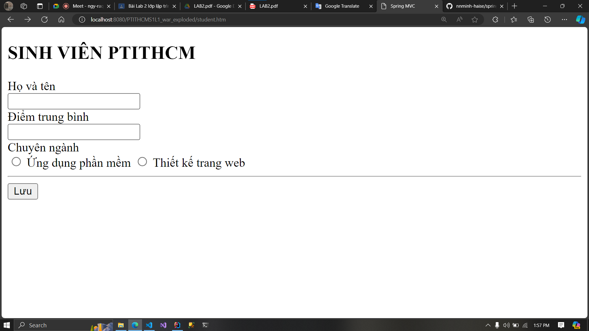
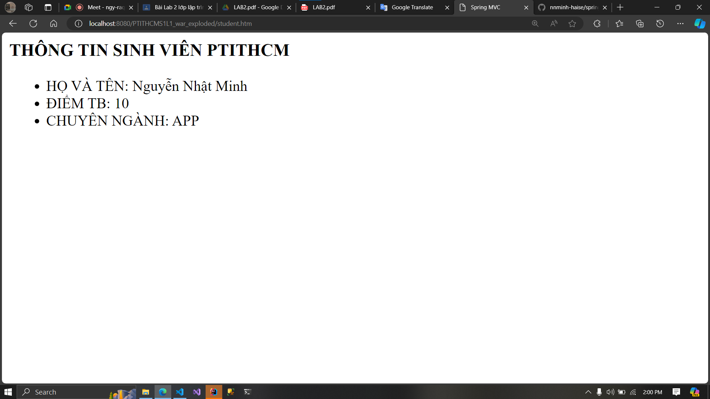

# Lab 2: Working with Controllers

---

This lab will use the previous code of the Lab 1.

## Exercise 1

We will modify the previous two controllers inside the `StudentController`.

*Previous code:*

```java
import org.springframework.stereotype.Controller;
import org.springframework.web.bind.annotation.RequestMapping;

import javax.servlet.http.HttpServletRequest;

@Controller
public class StudentController {
    @RequestMapping("/student/form")
    public String showForm() {
        return "student/form";
    }

    @RequestMapping("student/save-data")
    public String saveData(HttpServletRequest request) {
        String name = request.getParameter("name");
        String mark = request.getParameter("mark");
        String major = request.getParameter("major");

        request.setAttribute("name", name);
        request.setAttribute("mark", mark);
        request.setAttribute("major", major);
        return "student/success";
    }
}
```

*Modified code:*

```java
import org.springframework.stereotype.Controller;
import org.springframework.web.bind.annotation.RequestMapping;
import org.springframework.web.bind.annotation.RequestMethod;

import javax.servlet.http.HttpServletRequest;

@Controller
public class StudentController {
    @RequestMapping(value = "/student", method = RequestMethod.GET)
    public String showForm() {
        return "student/form";
    }

    @RequestMapping(value = "/student", method = RequestMethod.POST)
    public String saveData(HttpServletRequest request) {
        String name = request.getParameter("name");
        String mark = request.getParameter("mark");
        String major = request.getParameter("major");

        request.setAttribute("name", name);
        request.setAttribute("mark", mark);
        request.setAttribute("major", major);
        
        return "student/success";
    }
}
```

Inside the lab 1 exercise 4, we've created the two views: `form.jsp` and `success.jsp`:

`form.jsp`

```jsp
<%@ page pageEncoding="utf-8" %>
<!DOCTYPE html>
<html>
<head>
    <meta charset="utf-8"/>
    <title>Spring MVC</title>
    <base href="${pageContext.servletContext.contextPath}/">
</head>
<body>
    <h2>SINH VIÊN PTITHCM</h2>
    <form action="student/save-data.htm" method="post">
        <div>Họ và tên</div>
        <input name = "name"/>
        <div>Điểm trung bình</div>
        <input name = "mark"/>
        <div>Chuyên ngành</div>
        <label>
            <input name="major" type="radio" value="APP"/>
            Ứng dụng phần mềm
        </label>
        <label>
            <input name="major" type="radio" value="WEB"/>
            Thiết kế trang web
        </label>
        <hr>
        <button>Lưu</button>
    </form>
</body>
</html>
```

`success.jsp`

```jsp
<%@ page contentType="text/html;charset=UTF-8" %>
<html>
<head>
    <meta charset="utf-8">
    <title>Spring MVC</title>
</head>
<body>
    <h1>THÔNG TIN SINH VIÊN PTITHCM</h1>
    <ul>
        <li>HỌ VÀ TÊN: ${name}</li>
        <li>ĐIỂM TB: ${mark}</li>
        <li>CHUYÊN NGÀNH: ${major}</li>
    </ul>
</body>
</html>
```

We will modified the two like below:

`login.jsp`

```jsp
<%@ page pageEncoding="utf-8" %>
<!DOCTYPE html>
<html>
<head>
    <meta charset="utf-8"/>
    <title>Spring MVC</title>
    <base href="${pageContext.servletContext.contextPath}/">
</head>
<body>
    <h2>SINH VIÊN PTITHCM</h2>
    <form action="student.htm" method="post">
        <div>Họ và tên</div>
        <input name = "name"/>
        <div>Điểm trung bình</div>
        <input name = "mark"/>
        <div>Chuyên ngành</div>
        <label>
            <input name="major" type="radio" value="APP"/>
            Ứng dụng phần mềm
        </label>
        <label>
            <input name="major" type="radio" value="WEB"/>
            Thiết kế trang web
        </label>
        <hr>
        <button>Lưu</button>
    </form>
</body>
</html>
```

`success.jsp`

```jsp
<%@ page contentType="text/html;charset=UTF-8" %>
<html>
<head>
    <meta charset="utf-8">
    <title>Spring MVC</title>
</head>
<body>
    <h3>THÔNG TIN SINH VIÊN PTITHCM</h3>
    <ul>
        <li>HỌ VÀ TÊN: ${name}</li>
        <li>ĐIỂM TB: ${mark}</li>
        <li>CHUYÊN NGÀNH: ${major}</li>
    </ul>
</body>
</html>
```

Rerun the application at: `http://localhost:8080/PTITHCMS1L1_war_exploded/student.htm`



After filling the form, press "Submit" then the result will be at: `http://localhost:8080/PTITHCMS1L1_war_exploded/student.htm`




