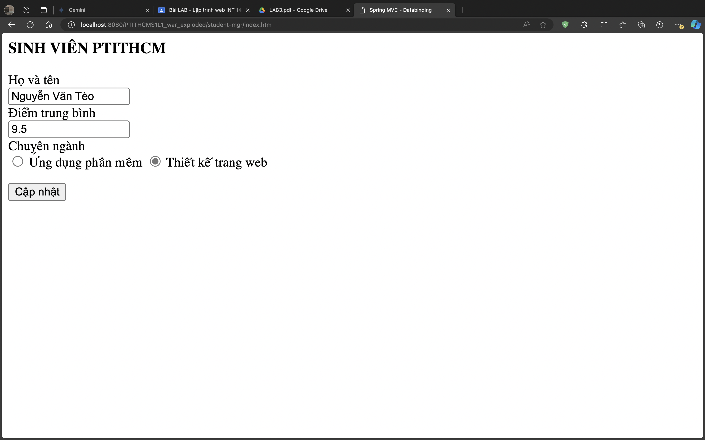
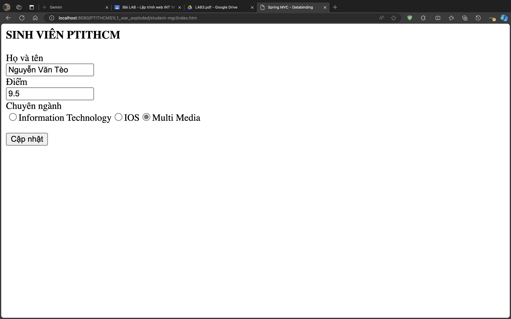
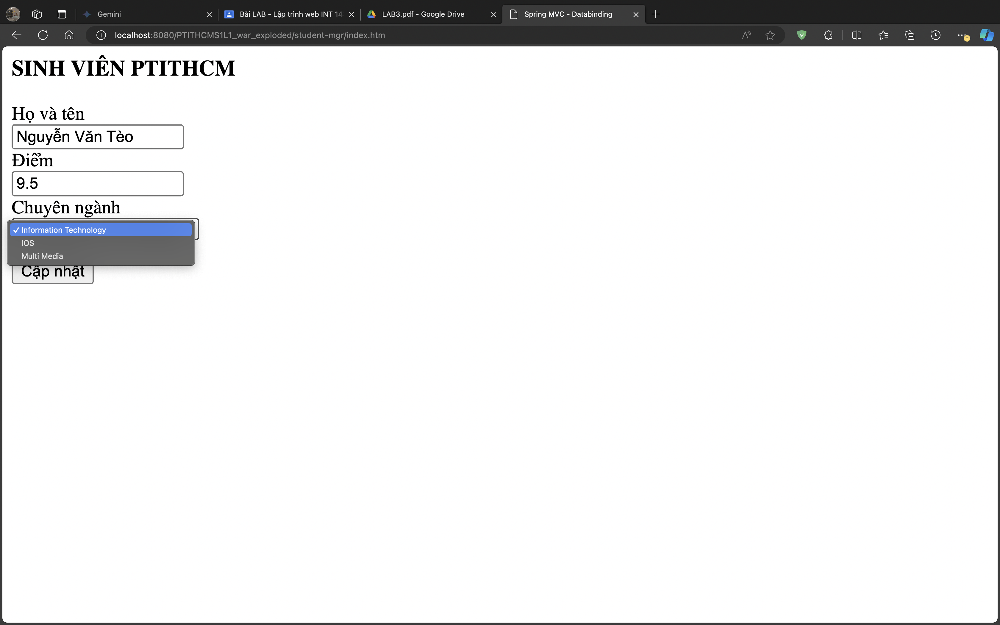
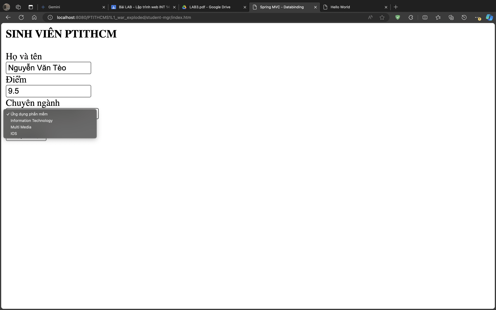

# Report lab 3

## Exercise 1

Modify the `index()` method inside the `StudentController`

`StudentController.java`

```java
@Controller
@RequestMapping("/student-mgr")
public class StudentController {
    // Other methods ...
    
    @RequestMapping("index")
    public String index(ModelMap model) {
        Student student = new Student("Nguyễn Văn Tèo", 9.5, "WEB");
        model.addAttribute("student", student);
        return "student/student";
    }

    // Other methods ...
}
```

Create a new `student.jsp` inside `views/student`

`student.jsp`

```jsp
<%@ page contentType="text/html;charset=UTF-8" language="java" %>
<html>
<head>
    <title>Spring MVC - Databinding</title>
    <base href="${pageContext.servletContext.contextPath}/">
</head>
<body>
<h3>SINH VIÊN PTITHCM</h3>
<form action="student/update.htm" modelAttribute="student">
    <div>Họ và tên</div>
    <input name="name" value="${student.name}">

    <div>Điểm trung bình</div>
    <input name="mark" value="${student.mark}">

    <div>Chuyên ngành</div>
    <label>
        <input name="major" type="radio" value="APP" ${student.major == 'APP'?'checked':''}/>
        Ứng dụng phần mềm
    </label>
    <label>
        <input name="major" type="radio" value="WEB" ${student.major == 'WEB'?'checked':''}/>
        Thiết kế trang web
    </label>
</form>

<div>
    <button>Cập nhật</button>
</div>
</body>
</html>
```

We've used a new expression for binding the return data from the controller to the `.jsp` file.

- `<input name="name" value="${student.name}">`
- `<input name="mark" value="${student.mark}">`
- `<input name="major" type="radio" value="APP" ${student.major == 'APP'?'checked':''}/>`
- `<input name="major" type="radio" value="WEB" ${student.major == 'WEB'?'checked':''}/>`

View result at:

`http://localhost:8080/PTITHCMS1L1_war_exploded/student-mgr/index.htm`



---

## Exercise 2

Create new `student2.jsp` in `views/student`

`student2.jsp`

```jsp
<%@ taglib prefix="form" uri="http://www.springframework.org/tags/form" %>
<%@ page contentType="text/html;charset=UTF-8" language="java" %>
<html>
<head>
  <title>Spring MVC - Databinding</title>
  <base href="${pageContext.servletContext.contextPath}/">
</head>
<body>
  <h3>SINH VIÊN PTITHCM</h3>
  <form:form action="student/update.htm" modelAttribute="student">
    <div>Họ và tên</div>
    <form:input path="name"/>

    <div>Điểm</div>
    <form:input path="mark"/>

    <div>Chuyên ngành</div>
    <form:radiobutton path="major" value="APP" label="Ứng dụng phần mềm"/>
    <form:radiobutton path="major" value="WEB" label="Thiết kế trang web"/>
  </form:form>

  <div>
    <button>Cập nhật</button>
  </div>
</body>
</html>
```

Modify the return path of the `index` method of `StudentController`

```java
@Controller
@RequestMapping("/student-mgr")
public class StudentController {
    // Other methods ...
    
    @RequestMapping("index")
    public String index(ModelMap model) {
        Student student = new Student("Nguyễn Văn Tèo", 9.5, "WEB");
        model.addAttribute("student", student);
        return "student/student2";
    }

    // Other methods ...
}
```

View result at:

`http://localhost:8080/PTITHCMS1L1_war_exploded/student-mgr/index.htm`


---

## Exercise 3 - Databinding into list control

In the real world where there are many majors and they might be stored inside a databse, so we can take data from the databse and bind them into a list then render them into html.

Insert a new `getMajors` method into the `StudentController`

```java
@Controller
@RequestMapping("/student-mgr")
public class StudentController {
    // Other methods ...
    
    @ModelAttribute("majors")
    public Map<String, String> getMajors() {
        Map<String, String> mj = new HashMap<>();
        mj.put("IT", "Information Technology");
        mj.put("ML", "Multi Media");
        mj.put("IOS", "IOS");
        return mj;
    }

    // Other methods ...
}
```

With this method, inside model we will have an attribute called `majors` and it has the return value of the `getMajors` method.

Inside the `student2.jsp` view, we modify the `form:radiobutton` into this:

```jsp
<%@ taglib prefix="form" uri="http://www.springframework.org/tags/form" %>
<%@ page contentType="text/html;charset=UTF-8" language="java" %>
<html>
<head>
  <title>Spring MVC - Databinding</title>
  <base href="${pageContext.servletContext.contextPath}/">
</head>
<body>
  <h3>SINH VIÊN PTITHCM</h3>
  <form:form action="student/update.htm" modelAttribute="student">
    <div>Họ và tên</div>
    <form:input path="name"/>

    <div>Điểm</div>
    <form:input path="mark"/>

    <div>Chuyên ngành</div>
    <form:radiobuttons path="major" items="${majors}"/>
  </form:form>

  <div>
    <button>Cập nhật</button>
  </div>
</body>
</html>
```

View result at:

`http://localhost:8080/PTITHCMS1L1_war_exploded/student-mgr/index.htm`



We also can change the `form:radiobuttons` into `form:select` to create a combobox



---

## Exercise 4

Another way to render a list of major is that we use a `List<javabean>` where `javabean` is a DTO - data transfer object contains the necessary information you want to render.

Create a `Major` class at package `bean`. This is a DTO javabean.

`major.java`

```java
package com.ptithcm.ptithcms1l1.bean;

public class Major {
    private String id;

    private String name;

    public Major() {
    }

    public Major(String id, String name) {
        this.id = id;
        this.name = name;
    }

    public String getId() {
        return id;
    }

    public void setId(String id) {
        this.id = id;
    }

    public String getName() {
        return name;
    }

    public void setName(String name) {
        this.name = name;
    }
}
```

Then we will modify the previous `getMajors` method inside the `StudentControllder`:

```java
@Controller
@RequestMapping("/student-mgr")
public class StudentController {
    // Other methods ...
    
    @ModelAttribute("majors")
    public List<Major> getMajors() {
        List<Major> mj = new ArrayList<>();
        mj.add(new Major("APP", "Ứng dụng phần mềm"));
        mj.add(new Major("ID", "Information Technology"));
        mj.add(new Major("ML", "Multi Media"));
        mj.add(new Major("IOS", "IOS"));
        return mj;
    }

    // Other methods ...
}
```

This way, inside the model we will have an attribute of majors with the value is the result of `List<Major>`.

To handle the `List<Major>` we will modify the code inside the `student2.jsp`

```jsp
<%@ taglib prefix="form" uri="http://www.springframework.org/tags/form" %>
<%@ page contentType="text/html;charset=UTF-8" language="java" %>
<html>
<head>
  <title>Spring MVC - Databinding</title>
  <base href="${pageContext.servletContext.contextPath}/">
</head>
<body>
  <h3>SINH VIÊN PTITHCM</h3>
  <form:form action="student/update.htm" modelAttribute="student">
    <div>Họ và tên</div>
    <form:input path="name"/>

    <div>Điểm</div>
    <form:input path="mark"/>

    <div>Chuyên ngành</div>
    <form:select path="major" items="${majors}" itemValue="id" itemLabel="name"/>
  </form:form>

  <div>
    <button>Cập nhật</button>
  </div>
</body>
</html>
```

View result at:

`http://localhost:8080/PTITHCMS1L1_war_exploded/student-mgr/index.htm`


