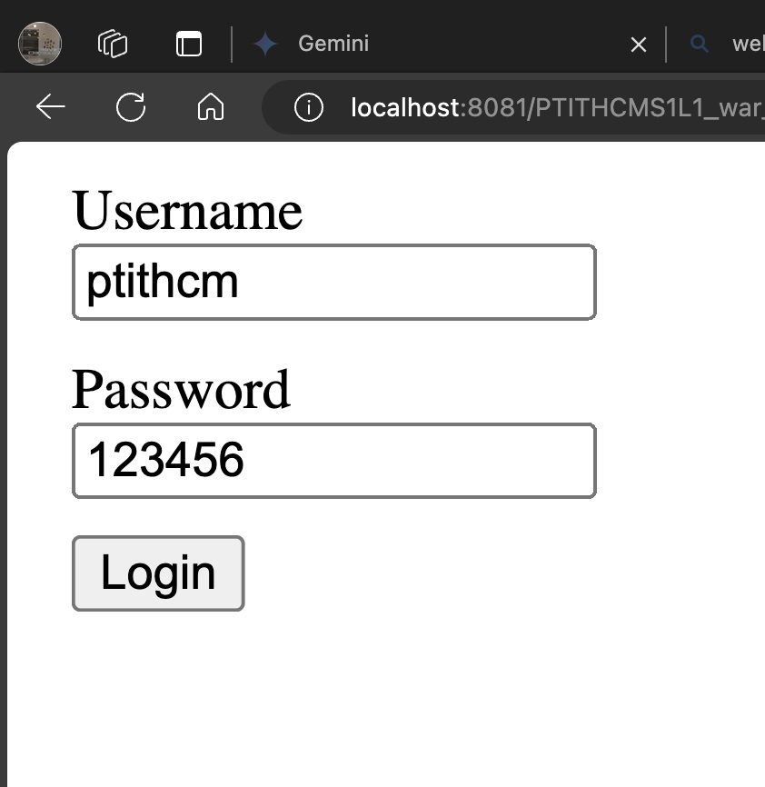
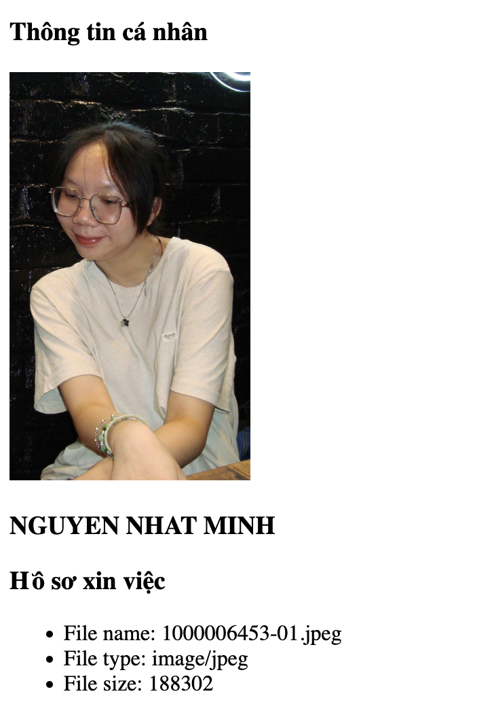
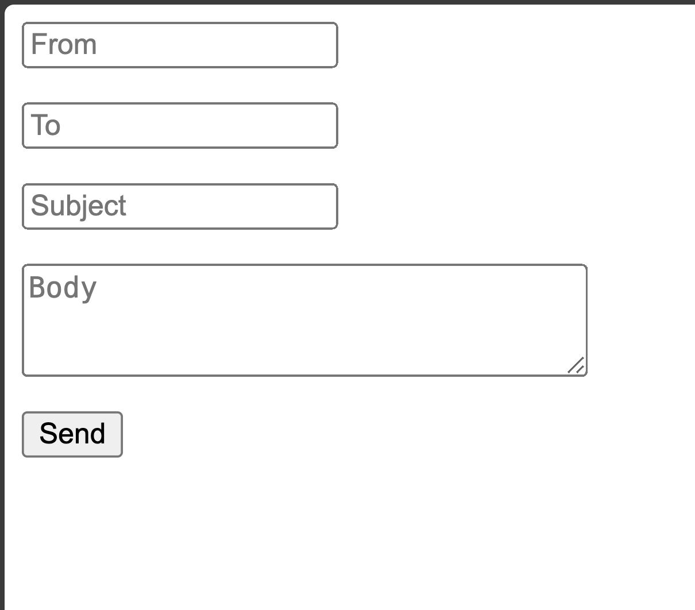
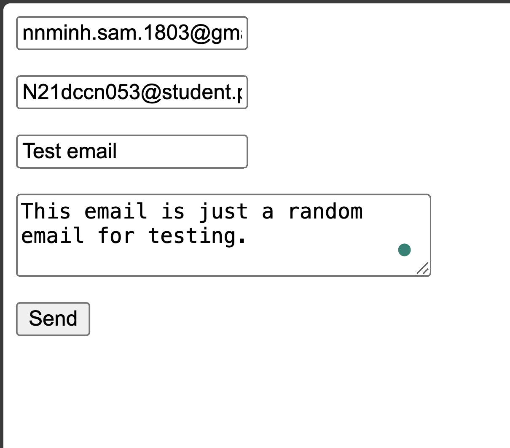
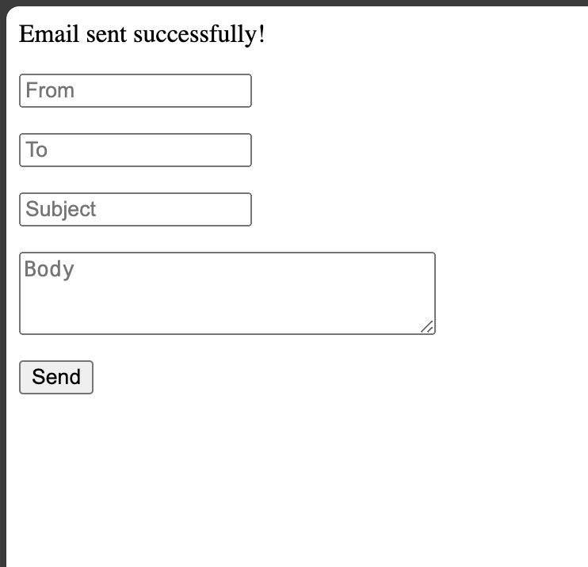
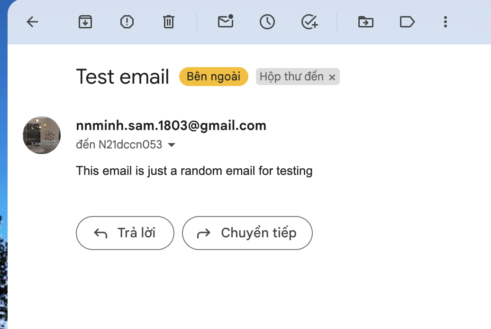
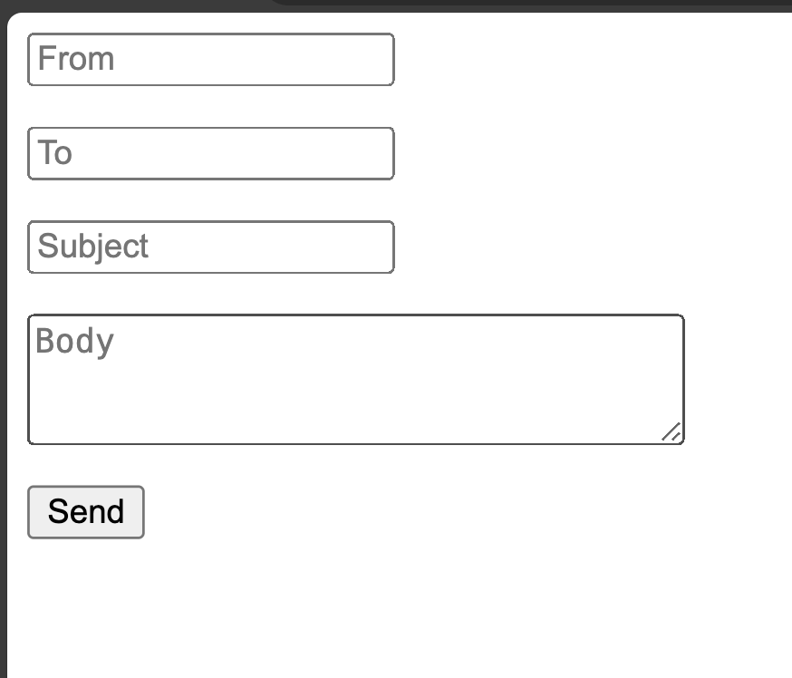
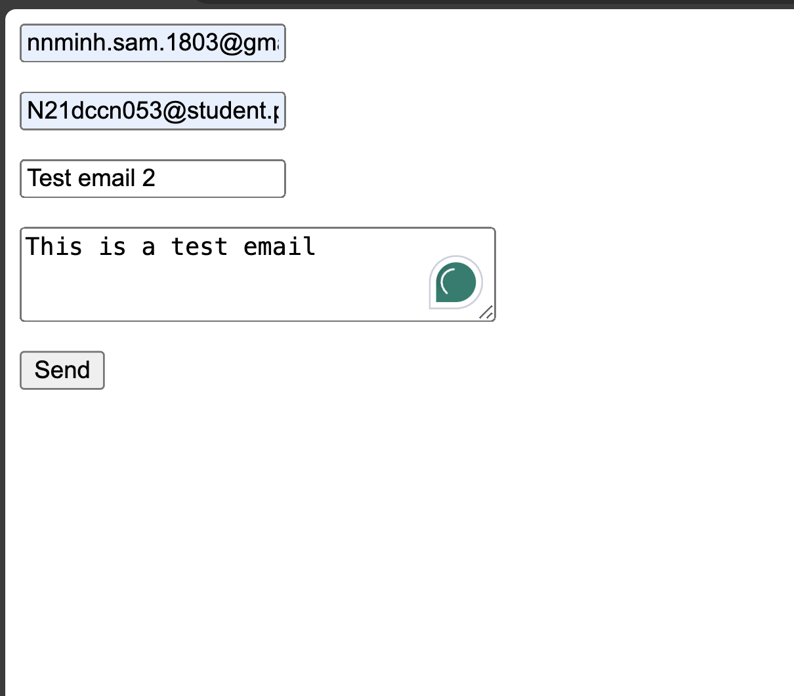
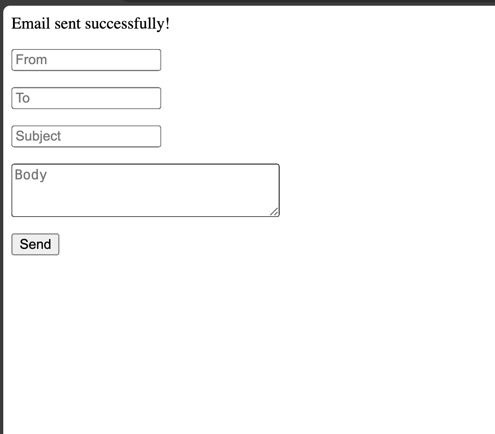
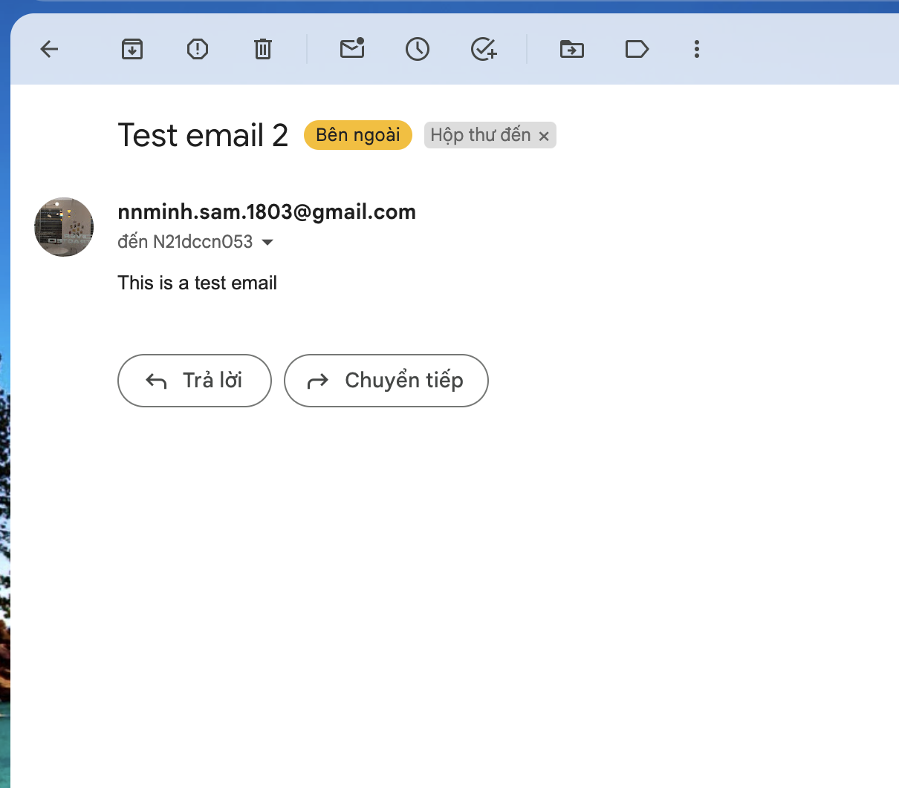

# Lab 5 - Bean & Dependency Injection

## Exercise 1

1. Create `User` model (bean) inside the `bean` package.

```java
public class User {
    private String username;
    private String password;

    public User() {
    }

    public User(String username, String password) {
        this.username = username;
        this.password = password;
    }

    public String getUsername() {
        return username;
    }

    public void setUsername(String username) {
        this.username = username;
    }

    public String getPassword() {
        return password;
    }

    public void setPassword(String password) {
        this.password = password;
    }
}
```

2. Create `HomeController` inside the `controller` package.

```java
@Controller
public class HomeController {
    @Autowired
    private User user;
}
```

At this step, the `User` model will not be considered as a Bean. Therefore, you cannot use the `@Autowired` annotation to inject the `User` model into the `HomeController`.

So, you need to declare the `User` bean inside a configuration file. Here, I'll configure it inside the `spring-config-mvc.xml` file.

```xml
<bean id="user" class="com.ptithcm.ptithcms1l1.bean.User">
    <property name="username" value="ptithcm"/>
    <property name="password" value="123456"/>
</bean>
```

3. Inject the bean into the `HomeController`.

After you declare the `User` bean inside the configuration file, now the `User` class is officially a Bean and can be injected into the `HomeController`.

Update the `HomeController` with new code:

```java
@Controller
@RequestMapping("/home")
public class HomeController {
    @Autowired
    private User user;

    @RequestMapping("index")
    public String index(ModelMap model) {
        return "home/index";
    }

    @ModelAttribute("user")
    public User getUser() {
        return this.user;
    }
}
```

4. Creating view.

Inside the `views` directory, create a view at: `home/index.jsp`.

```html
<%--
  Created by IntelliJ IDEA.
  User: nnminh
  Date: 25/03/2024
  Time: 21:18
  To change this template use File | Settings | File Templates.
--%>
<%@ page contentType="text/html;charset=UTF-8" language="java" %>
<!DOCTYPE html>
<html>
<head>
  <meta charset="utf-8"/>
  <title>Dependency Injection</title>
  <style>
    .form-group {
      margin: 10px;
    }
  </style>
</head>
<body>
  <form>
    <div class="form-group">
      <div>Username</div>
      <input name="id" value="${user.username}">
    </div>

    <div class="form-group">
      <div>Password</div>
      <input name="id" value="${user.password}">
    </div>

    <div class="form-group">
      <button>Login</button>
    </div>
  </form>
</body>
</html>
```

5. Run the server and go to `/home/index.htm` to see the form.



> Note that the value inside the username and password input must be identical to the one inside the `.xml` configuration file.

## Exercise 2

1. Create a new Bean `MultipartResolver` to handle file upload:

```xml
<bean id="multipartResolver" class="org.springframework.web.multipart.commons.CommonsMultipartResolver">
    <property name="maxUploadSize" value="20971520"/>
</bean>
```

2. Add these dependencies into your `pom.xml` file:

```xml
<dependencies>
    <!-- https://mvnrepository.com/artifact/commons-io/commons-io -->
    <dependency>
        <groupId>commons-io</groupId>
        <artifactId>commons-io</artifactId>
        <version>1.3.2</version>
    </dependency>

    <!-- https://mvnrepository.com/artifact/commons-fileupload/commons-fileupload -->
    <dependency>
        <groupId>commons-fileupload</groupId>
        <artifactId>commons-fileupload</artifactId>
        <version>1.2.2</version>
    </dependency>    
</dependencies>
```

3. Create a `JobController` to handle the form page.

```java
import org.springframework.stereotype.Controller;
import org.springframework.web.bind.annotation.RequestMapping;

@Controller
@RequestMapping("/job")
public class JobController {

    @RequestMapping("form")
    public String form() {
        return "job/form";
    }
}
```

4. Create a `form.jsp` inside the `views/job` directory.

```html
<%--
  Created by IntelliJ IDEA.
  User: nnminh
  Date: 26/03/2024
  Time: 00:47
  To change this template use File | Settings | File Templates.
--%>
<%@ page contentType="text/html;charset=UTF-8" language="java" %>
<!DOCTYPE html>
<html>
<head>
    <base href="${pageContext.servletContext.contextPath}/">
    <meta charset="utf-8" />
    <title>Exercise 2 - Upload file</title>
    <style>
        .form-group {
            margin: 10px;
        }
    </style>
</head>
<body>
    <h2>Nộp đơn xin việc</h2>
    ${message}
    <form action="job/apply.htm" method="post" enctype="multipart/form-data">
        <div class="form-group">
            <div>Họ và tên ứng viên</div>
            <input type="text" name="fullname">
        </div>

        <div class="form-group">
            <div>Hình ảnh</div>
            <input type="file" name="photo">
        </div>

        <div class="form-group">
            <div>Hồ sơ xin việc</div>
            <input type="file" name="cv">
        </div>

        <div class="form-group">
            <button>Submit</button>
        </div>
    </form>
</body>
</html>
```

5. Create an action method to handle file upload.

```java
public class JobController {
    @RequestMapping("apply")
    public String apply(
            ModelMap model,
            @RequestParam("fullname") String fullname,
            @RequestParam("cv") MultipartFile cv,
            @RequestParam("photo") MultipartFile photo) {
        if (photo.isEmpty() || cv.isEmpty()) {
            model.addAttribute("message", "Vui lòng chọn file!");
        } else {
            try {
                String photoPath = context.getRealPath("/files/" + photo.getOriginalFilename());
                photo.transferTo(new File(photoPath));
                String cvPath = context.getRealPath("/files/" + cv.getOriginalFilename());
                cv.transferTo(new File(cvPath));

                model.addAttribute("photo_name", photo.getOriginalFilename());
                model.addAttribute("cv_name", cv.getOriginalFilename());
                model.addAttribute("cv_type", cv.getContentType());
                model.addAttribute("cv_size", cv.getSize());

                return "job/apply";

            } catch (Exception e) {
                model.addAttribute("message", "Lỗi lưu file!");
            }
        }

        return "job/form";
    }
}
```

6. Create the `apply` view inside the `views/job` directory.

```html
<%--
  Created by IntelliJ IDEA.
  User: nnminh
  Date: 26/03/2024
  Time: 00:47
  To change this template use File | Settings | File Templates.
--%>
<%@ page contentType="text/html;charset=UTF-8" language="java" %>
<!DOCTYPE html>
<html>
<head>
    <base href="${pageContext.servletContext.contextPath}/">
    <meta charset="utf-8" />
    <title>Exercise 2 - Upload file</title>
    <style>
        .form-group {
            margin: 10px;
        }
    </style>
</head>
<body>
    <p>
        <h3>Thông tin cá nhân</h3>
        
        <br>
        <h3>${param.fullname}</h3>
    </p>

    <p>
        <h3>Hồ sơ xin việc</h3>
        <ul>
            <li>File name: ${cv_name}</li>
            <li>File type: ${cv_type}</li>
            <li>File size: ${cv_size}</li>
        </ul>
    </p>
</body>
</html>
```

Run the server and go to `/job/form.htm` to fill out the form and press submit to see the result.



## Exercise 3

0. Add this dependency into the `pom.xml` file.

```xml
<dependencies>
    <dependency>
        <groupId>org.springframework</groupId>
        <artifactId>spring-context-support</artifactId>
        <version>4.0.1.RELEASE</version>
    </dependency>

    <!-- https://mvnrepository.com/artifact/javax.mail/javax.mail-api -->
    <dependency>
        <groupId>javax.mail</groupId>
        <artifactId>javax.mail-api</artifactId>
        <version>1.5.6</version>
    </dependency>

    <!-- https://mvnrepository.com/artifact/com.sun.activation/javax.activation -->
    <dependency>
        <groupId>com.sun.activation</groupId>
        <artifactId>javax.activation</artifactId>
        <version>1.2.0</version>
    </dependency>
</dependencies>
```

1. Create JavaMailSender Bean inside the `spring-config-mvc.xml`

```xml
<bean id="mailSender" class="org.springframework.mail.javamail.JavaMailSenderImpl">
    <property name="host" value="smtp.gmail.com"/>
    <property name="port" value="587"/>
    <property name="username" value="nnminh.sam.1803@gmail.com"/>
    <property name="password" value="gleetqoxykdjalws"/>
    <property name="defaultEncoding" value="UTF-8"/>
    <property name="javaMailProperties">
        <props>
            <prop key="mail.smtp.auth">true</prop>
            <prop key="mail.smtp.socketFactory.class">javax.net.ssl.SSLSocketFactory</prop>
            <prop key="mail.smtp.socketFactory.port">465</prop>
            <prop key="mail.smtp.starttls.enable">false</prop>
            <prop key="mail.debug">true</prop>
        </props>
    </property>
</bean>
```

2. Create a action method route the client to the form.

```java
@Controller
@RequestMapping("/mailer")
public class MailerController {
    @RequestMapping("form")
    public  String index() {
        return "mailer/form";
    }
}
```

3. Create a `form.jsp` inside the `views/mailer`.

```html
<%--
  Created by IntelliJ IDEA.
  User: nnminh
  Date: 26/03/2024
  Time: 21:51
  To change this template use File | Settings | File Templates.
--%>
<%@ page contentType="text/html;charset=UTF-8" language="java" %>
<html>
<head>
  <base href="${pageContext.servletContext.contextPath}/">
  <meta charset="utf-8" />
  <title>Exercise 3 - Send email</title>
</head>
<body>
  ${message}
  <form action="mailer/send.htm" method="post">
    <p><input name="from" placeholder="From"></p>
    <p><input name="to" placeholder="To"></p>
    <p><input name="subject" placeholder="Subject"></p>
    <p><textarea name="body" placeholder="Body" rows="3" cols="30"></textarea></p>
    <button>Send</button>
  </form>
</body>
</html>
```

4. Create an action method which send an email.

```java
@Controller
@RequestMapping("/mailer")
public class MailerController {
    @Autowired
    private JavaMailSender mailSender;

    @RequestMapping("form")
    public String index() {
        return "mailer/form";
    }

    @RequestMapping("send")
    public String send(ModelMap model,
        @RequestParam("from") String from,
        @RequestParam("to") String to,
        @RequestParam("subject") String subject,
        @RequestParam("body") String body) {
        try {
            MimeMessage mail = mailSender.createMimeMessage();

            MimeMessageHelper helper = new MimeMessageHelper(mail);
            helper.setFrom(from, from);
            helper.setTo(to);
            helper.setReplyTo(from, from);
            helper.setSubject(subject);
            helper.setText(body, true);

            mailSender.send(mail);
            model.addAttribute("message", "Email sent successfully!");
        } catch (Exception e) {
            model.addAttribute("message", "Failed to send email!");
        }

        return "mailer/form";
    }
}
```

Run the server and go to `/mailer/form.htm` to see the form:









## Exercise 4

1. Create bean `XMailer` inside the `service` package.

```java
@Service
public class Mailer {
    @Autowired
    JavaMailSender mailer;

    public void send(String from, String to, String subject, String body) {
        try {
            MimeMessage mail = mailer.createMimeMessage();
            MimeMessageHelper helper = new MimeMessageHelper(mail, true, "utf-8");

            helper.setFrom(from, from);
            helper.setTo(to);
            helper.setSubject(subject);
            helper.setReplyTo(from, from);
            helper.setText(body, true);

            mailer.send(mail);
        } catch (Exception e) {
            throw new RuntimeException(e);
        }
    }
}
```

2. Add the `service` package into the `spring-config-mvc.xml` file.

```xml
<context:component-scan base-package="com.ptithcm.ptithcms1l1.service"/>
```

3. Create a `Mailer2Controller` similar to the `MailerController` to test.

```java
package com.ptithcm.ptithcms1l1.controller;

import com.ptithcm.ptithcms1l1.service.Mailer;
import org.springframework.beans.factory.annotation.Autowired;
import org.springframework.mail.javamail.JavaMailSender;
import org.springframework.mail.javamail.MimeMessageHelper;
import org.springframework.stereotype.Controller;
import org.springframework.ui.ModelMap;
import org.springframework.web.bind.annotation.RequestMapping;
import org.springframework.web.bind.annotation.RequestParam;

import javax.mail.internet.MimeMessage;

@Controller
@RequestMapping("/mailer2")
public class Mailer2Controller {
    @Autowired
    private Mailer mailer;

    @RequestMapping("form")
    public String index() {
        return "mailer/form";
    }

    @RequestMapping("send")
    public String send(ModelMap model,
                       @RequestParam("from") String from,
                       @RequestParam("to") String to,
                       @RequestParam("subject") String subject,
                       @RequestParam("body") String body) {
        try {
            mailer.send(from, to, subject, body);

            model.addAttribute("message", "Email sent successfully!");
        } catch (Exception e) {
            System.out.println("LOG: " + e.getMessage());
            model.addAttribute("message", "Failed to send email!");
        }

        return "mailer/form";
    }
}
```

4. Go to `/mailer2/form.htm` to try and test the functionality.








