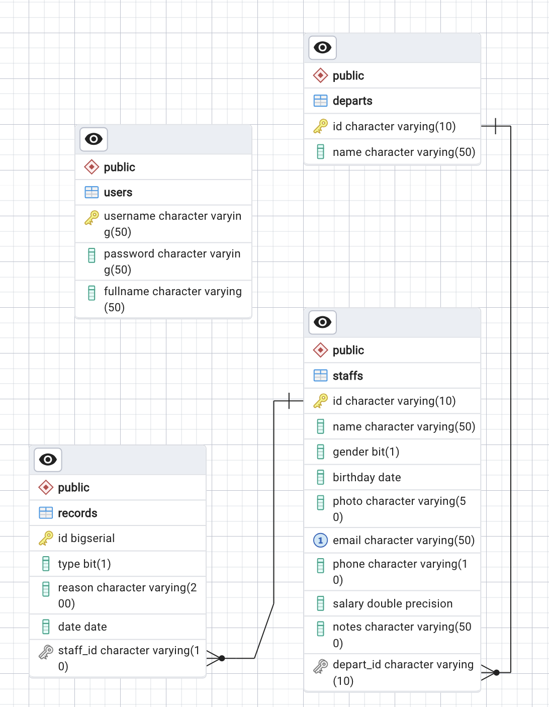

# Report lab 6

---

## Database diagram

Usage:

- DBMS: PostgreSQL



## Exercise 1

### Adding dependencies

Since in this project, we will use PostgreSQL, we need to add the JDBC driver of PostgreSQL:

```xml
<!-- https://mvnrepository.com/artifact/org.springframework/spring-orm -->
<dependency>
    <groupId>org.springframework</groupId>
    <artifactId>spring-orm</artifactId>
    <version>6.1.5</version>
</dependency>

<!-- https://mvnrepository.com/artifact/org.postgresql/postgresql -->
<dependency>
    <groupId>org.postgresql</groupId>
    <artifactId>postgresql</artifactId>
    <version>42.7.3</version>
</dependency>
```

Also, you need to add these dependencies:

```xml
<!-- https://mvnrepository.com/artifact/org.springframework/spring-core -->
<dependency>
    <groupId>org.springframework</groupId>
    <artifactId>spring-core</artifactId>
    <version>4.0.1.RELEASE</version>
</dependency>

<!-- https://mvnrepository.com/artifact/org.springframework/spring-orm -->
<dependency>
    <groupId>org.springframework</groupId>
    <artifactId>spring-orm</artifactId>
    <version>4.0.1.RELEASE</version>
</dependency>

<!-- https://mvnrepository.com/artifact/org.postgresql/postgresql -->
<dependency>
    <groupId>org.postgresql</groupId>
    <artifactId>postgresql</artifactId>
    <version>42.7.3</version>
</dependency>

<!-- https://mvnrepository.com/artifact/aopalliance/aopalliance -->
<dependency>
    <groupId>aopalliance</groupId>
    <artifactId>aopalliance</artifactId>
    <version>1.0</version>
</dependency>

<!-- https://mvnrepository.com/artifact/com.mchange/c3p0 -->
<dependency>
    <groupId>com.mchange</groupId>
    <artifactId>c3p0</artifactId>
    <version>0.10.0</version>
</dependency>

<!-- https://mvnrepository.com/artifact/org.dom4j/dom4j -->
<dependency>
    <groupId>org.dom4j</groupId>
    <artifactId>dom4j</artifactId>
    <version>2.1.4</version>
</dependency>

<!-- https://mvnrepository.com/artifact/org.hibernate.orm/hibernate-c3p0 -->
<dependency>
    <groupId>org.hibernate.orm</groupId>
    <artifactId>hibernate-c3p0</artifactId>
    <version>6.5.0.CR1</version>
</dependency>

<!-- https://mvnrepository.com/artifact/org.hibernate.common/hibernate-commons-annotations -->
<dependency>
    <groupId>org.hibernate.common</groupId>
    <artifactId>hibernate-commons-annotations</artifactId>
     <version>6.0.6.Final</version>
</dependency>

<!-- https://mvnrepository.com/artifact/org.hibernate/hibernate-core -->
<dependency>
    <groupId>org.hibernate</groupId>
    <artifactId>hibernate-core</artifactId>
    <version>6.5.0.CR1</version>
    <type>pom</type>
</dependency>

<!-- https://mvnrepository.com/artifact/org.hibernate.orm/hibernate-ehcache -->
<dependency>
    <groupId>org.hibernate.orm</groupId>
    <artifactId>hibernate-ehcache</artifactId>
    <version>6.0.0.Alpha7</version>
</dependency>

<!-- https://mvnrepository.com/artifact/org.hibernate/hibernate-entitymanager -->
<dependency>
    <groupId>org.hibernate</groupId>
    <artifactId>hibernate-entitymanager</artifactId>
    <version>6.0.0.Alpha7</version>
    <type>pom</type>
</dependency>

<!-- https://mvnrepository.com/artifact/jakarta.persistence/jakarta.persistence-api -->
<dependency>
    <groupId>jakarta.persistence</groupId>
    <artifactId>jakarta.persistence-api</artifactId>
    <version>3.2.0-M2</version>
</dependency>

<!-- https://mvnrepository.com/artifact/org.javassist/javassist -->
<dependency>
    <groupId>org.javassist</groupId>
    <artifactId>javassist</artifactId>
    <version>3.30.2-GA</version>
</dependency>

<!-- https://mvnrepository.com/artifact/org.jboss.logging/jboss-logging -->
<dependency>
    <groupId>org.jboss.logging</groupId>
    <artifactId>jboss-logging</artifactId>
    <version>3.5.3.Final</version>
</dependency>

<!-- https://mvnrepository.com/artifact/org.jboss.javaee/jboss-transaction-api -->
<dependency>
    <groupId>org.jboss.javaee</groupId>
    <artifactId>jboss-transaction-api</artifactId>
    <version>1.0.1.20070913080910</version>
</dependency>

<!-- https://mvnrepository.com/artifact/com.mchange/mchange-commons-java -->
<dependency>
    <groupId>com.mchange</groupId>
    <artifactId>mchange-commons-java</artifactId>
    <version>0.3.0</version>
</dependency>

<!-- https://mvnrepository.com/artifact/org.slf4j/slf4j-api -->
<dependency>
    <groupId>org.slf4j</groupId>
    <artifactId>slf4j-api</artifactId>
    <version>2.1.0-alpha1</version>
</dependency>

<!-- https://mvnrepository.com/artifact/org.slf4j/slf4j-simple -->
<dependency>
    <groupId>org.slf4j</groupId>
    <artifactId>slf4j-simple</artifactId>
    <version>2.1.0-alpha1</version>
    <scope>test</scope>
</dependency>
```

### Bean configuration

Create these beans inside the `spring-config-mvc.xml`

```xml
    <bean id="dataSource"
          class="org.springframework.jdbc.datasource.DriverManagerDataSource"
          p:driverClassName="org.postgresql.Driver"
          p:url="jdbc:postgresql://localhost:5433/spring-lab-personel"
          p:username="postgres"
          p:password="postgres">
    </bean>

    <bean id="sessionFactory" class="org.springframework.orm.hibernate4.LocalSessionFactoryBean">
        <property name="dataSource" ref="dataSource"/>
        <property name="hibernateProperties">
            <props>

<!--                <prop key="hibernate.dialect">org.hibernate.dialect.PostgreSQLDialect</prop>-->
                <prop key="hibernate.show_sql">true</prop>
            </props>
        </property>
        <property name="packagesToScan" value="com.ptithcm.ptithcms1l1.model"/>
    </bean>

    <bean id="transactionManager"
          class="org.springframework.orm.hibernate4.HibernateTransactionManager"
          p:sessionFactory-ref="sessionFactory">
    </bean>
    <tx:annotation-driven transaction-manager="transactionManager"/>
```

## Exercise 2

Build the model for all the table inside the above database.

Create a `model` package and add these models:

`User`

```java
import jakarta.persistence.Column;
import jakarta.persistence.Entity;
import jakarta.persistence.Id;
import jakarta.persistence.Table;

@Entity
@Table(name="users")
public class User {
    @Id
    @Column(unique = true, nullable = false)
    private String username;

    @Column(nullable = false)
    private String password;

    @Column(nullable = false)
    private String fullname;
}
```

`Depart`

```java
import jakarta.persistence.*;

import java.util.Collection;

@Entity
@Table(name="departs")
public class Depart {
    @Id
    @Column(unique = true, nullable = false)
    private String id;

    @Column(nullable = false)
    private String name;

    @OneToMany(mappedBy = "depart", fetch = FetchType.EAGER)
    private Collection<Staff> staffs;
}
```

`Staff`

```java
import com.ptithcm.ptithcms1l1.model.Depart;

import jakarta.persistence.*;
import org.springframework.format.annotation.DateTimeFormat;

import java.time.LocalDate;
import java.util.Collection;

@Entity
@Table(name="staffs")
public class Staff {
    @Id
    @Column(unique = true, nullable = false)
    private String id;

    @Column(nullable = false)
    private String name;

    @Column(nullable = false)
    private Boolean gender;

    @Column(nullable = false)
    @javax.persistence.Temporal(javax.persistence.TemporalType.DATE)
    @DateTimeFormat(pattern = "yyyy/MM/dd")
    private LocalDate birthday;

    @Column(nullable = false)
    private String photo;

    @Column(nullable = false, unique = true)
    private String email;

    @Column(nullable = false)
    private String phone;

    @Column(nullable = false)
    private Double salary;

    @Column(nullable = false)
    private String notes;

    @ManyToOne
    @JoinColumn(name="depart_id")
    private Depart depart;

    @OneToMany(mappedBy = "staff", fetch = FetchType.EAGER)
    private Collection<Record> records;
}
```

`Record`

```java
import jakarta.persistence.*;
import org.springframework.format.annotation.DateTimeFormat;

import java.time.LocalDate;

@Entity
@Table(name="records")
public class Record {
    @Id
    @GeneratedValue
    private Integer id;

    private Boolean type;

    private String reason;

    @javax.persistence.Temporal(javax.persistence.TemporalType.DATE)
    @DateTimeFormat(pattern = "yyyy/MM/dd")
    private LocalDate date;

    @ManyToOne
    @JoinColumn(name="staff_id")
    private Staff staff;
}
```

The getters/setters for each model you can create yourself.

## Exercise 3


